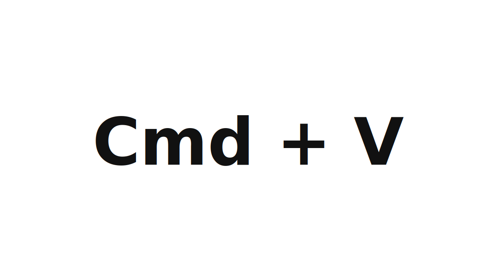

<p align="center">
  
</p>

# BitPaste

BitPaste is a tiny macOS helper for pasting long prompts into Codex.

When a prompt is big enough, Codex can treat the paste like a file attachment. The usual workaround is painful: paste the prompt into another editor, copy a smaller piece, paste that into Codex, then repeat until the whole thing is in. BitPaste automates that loop. Copy the full prompt once, focus Codex, press the shortcut, and BitPaste feeds the clipboard into Codex in smaller paste chunks.

Default shortcut:

```text
command+option+shift+v
```

## Install

Run this one command:

```sh
/bin/bash -c "$(curl -fsSL https://raw.githubusercontent.com/B60-0/bitpaste/main/install.sh)"
```

That downloads the latest BitPaste DMG, installs `BitPaste.app` into `~/Applications`, starts it at login, and opens the macOS Accessibility settings pane.

macOS still requires one manual permission step: enable `BitPaste.app` in `System Settings > Privacy & Security > Accessibility`.

## Download

You can also download `BitPaste.dmg` from the [latest release](https://github.com/B60-0/bitpaste/releases/latest).

Open the DMG, drag `BitPaste.app` into `Applications`, then open BitPaste once. BitPaste will create its config file, install its login item, and open the Accessibility settings pane.

## Configure

The installer creates:

```text
~/.config/bitpaste/config.json
```

Default config:

```json
{
  "chunkSize": 1200,
  "delayMs": 75,
  "initialDelayMs": 120,
  "waitForShortcutReleaseMs": 1000,
  "hotkey": "command+option+shift+v",
  "restoreClipboard": true
}
```

If Codex drops chunks or receives them out of order, increase `delayMs` to `100` or `150`.

Supported hotkey keys are letters, digits, `space`, `tab`, `return`, and `escape`. Supported modifiers are `command`, `control`, `option`, and `shift`.

After changing config, restart BitPaste:

```sh
launchctl kickstart -k gui/$UID/app.bitpaste
```

## Build From Source

```sh
make install
```

To build the release DMG:

```sh
make dmg
```

## Uninstall

```sh
make uninstall
```

This removes the LaunchAgent and installed app. Your config file is left in place.
